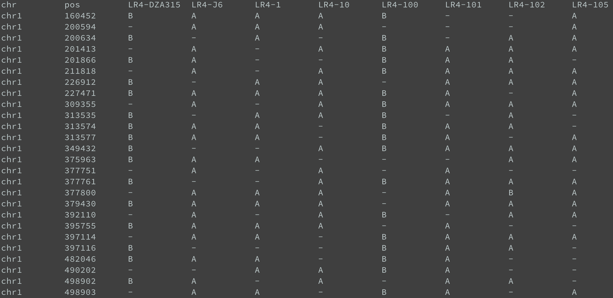
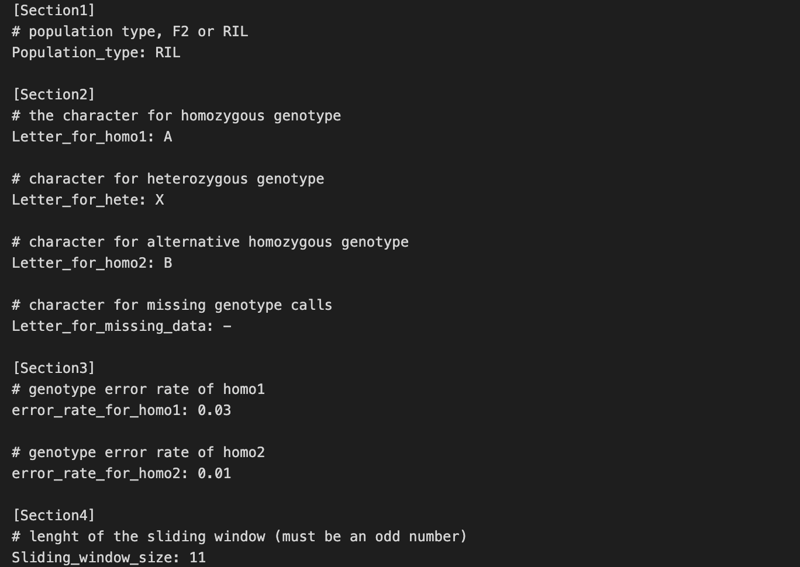
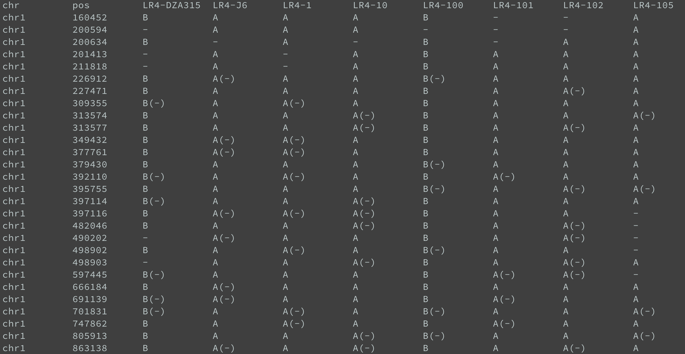

## step 1. prepare genotype data to the required data format

The input genotype table is a tab delimited text file including genotypes for each sample/line in a population. Markers need to be sorted by position within each chromosome or contig. The default characters for homozygous and heterozygous genotypes, as well as missing values can be defined in the configuration file. 

A typical input genotype table for GC should look like this:


If your genotype data is in vcf format, you can use this command line to convert it to the required format:
```
$ python -m schnablelab.GC.data_qc vcf2map input.vcf output.map
```


## step 2. QC (quality control) on genotype data

Couple of QC steps on genotype data are needed before conducting the correction step.
The example data used in this demo can be found in the repo `unl-schnablelab/src/schnablelab/GC/data`

### QC on missing data

This step will remove SNPs and samples whose missing ratio is higher than the specified `cutoff_snp` and `cutoff_sample`. 

```
$ python -m schnablelab.GC.data_qc qc_missing RIL_X0.4miss0.35.map qc_missing.map --cutoff_snp 0.4 --cutoff_sample 0.4
```
where `RIL_X0.4miss0.35.map` is an example input genotype table, `qc_missing.map` is the table after removing high missing ratio SNPs and samples. 


### QC on SNPs with distorted segregation ratio

This step will remove SNPs in which the segregation ratio is highly distorted. 

```
$ python -m schnablelab.GC.data_qc qc_sd qc_missing.map qc_segregation.map --population RIL
```
where `qc_missing.map` is the table from qc_missing step and the `qc_segregation.map` is the output table.

### QC on homozygous genotype calls found in a heterozygous region

This step will aggregate small regions defined by read length in bp where continuous homozygous genotype calls are observed within a heterozygous region. 

```
$ python -m schnablelab.GC.data_qc qc_hetero qc_segregation.map qc_hetero.map --read_len 150
```
where `qc_segregation.map` is the table from qc_sd step and the `qc_hetero.map` is the output table. The length of the small region is defined by the parameter `--read_len`. This step will also generate a log file `GC.qc_hetero.info` including regions that were aggregated. 


### QC on duplicated SNP markers

This step will aggregate consecutive markers with identical genotype calls across all samples/lines. 
```
$ python -m schnablelab.GC.data_qc qc_dup qc_hetero.map qc_dup.map
```
where `qc_hetero.map` is the table from qc_hetero step and the `qc_dup.map` is the output table. You can use parameter `--diff_num` to define how many different genotype calls can be tolerated between two consecutive SNP markers. The fefault value is 0 which means you can only aggregate two consecutive markers when they are identical excluding missing values. The aggregation info from this step can be found in the log file `GC.qc_dup.log`.


## step 3. Conduct the correction

### prepare the configuration file

The configuration file defines parameters for the correction step. You can find an [example config file](https://github.com/chenyong89/unl-schnablelab/blob/main/src/schnablelab/GC/data/config.txt) in the repo and modify it based on your own input data.



### run GC

Once you get the genotype table after rounds of QC and the config file, you can run Genotype-Corrector using this command:

```
$ python -m schnablelab.GC.corrector correct config.txt qc_dup.map --itertimes 5
```

Once correction concludes, you will see the output table `qc_dup.corrected.map` generated where missing values were imputed and genotype calls were corrected. if you add `--debug` parameter to above command line, the output table will contains both corrected genotype calls followed by the original one highlighted in parentheses as shown below. 



You can manually debug results if you found obvious wrong corrections by GC in this file. Once done, you can run `python -m schnablelab.GC.corrector cleanup` command to remove redudant info in the table. If you want to convert results to other format such as R/QTL or MSTmap, you can use `python -m schnable.GC.corrector format` command to convert it to other formats for downstream analyses.


## Tips

* GC has best performance on high density marker datasets generated from high throughput sequencing. Each contig should have at least hundreds of markers.
* Some missing values will not be imputed by GC when there is no strong evidence to support the imputation, which is also true for genotyep call correstions. 
* Grid search of input parameters such as sliding window size is recommended to achieve the best results. 